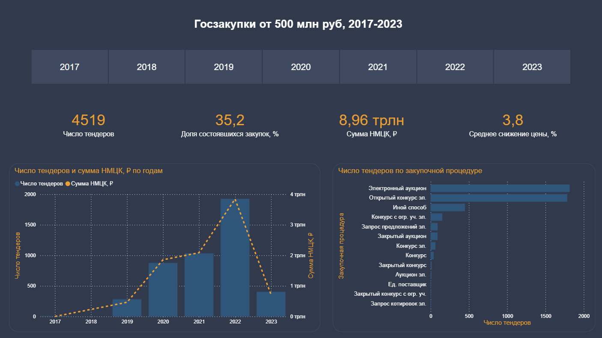
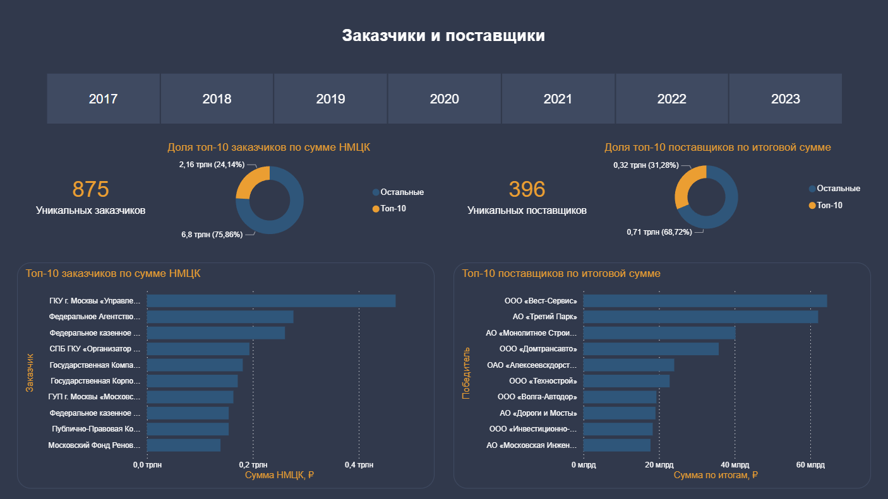
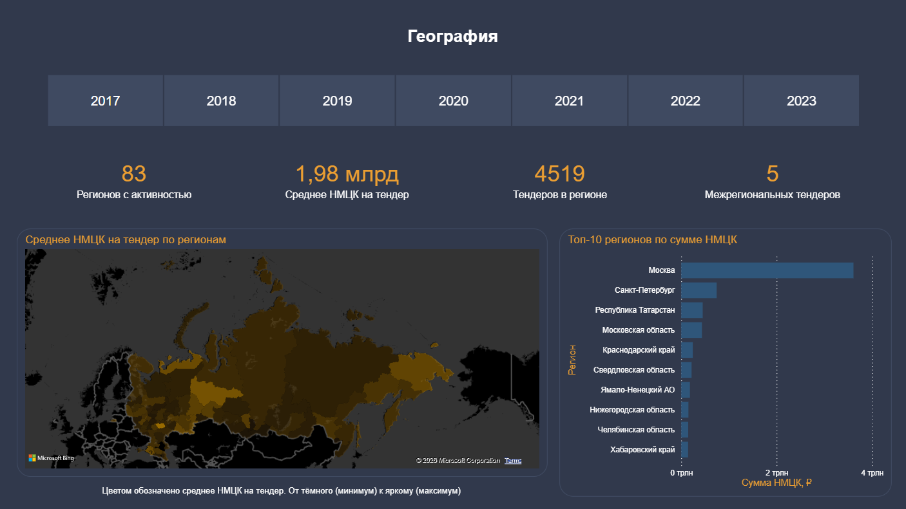
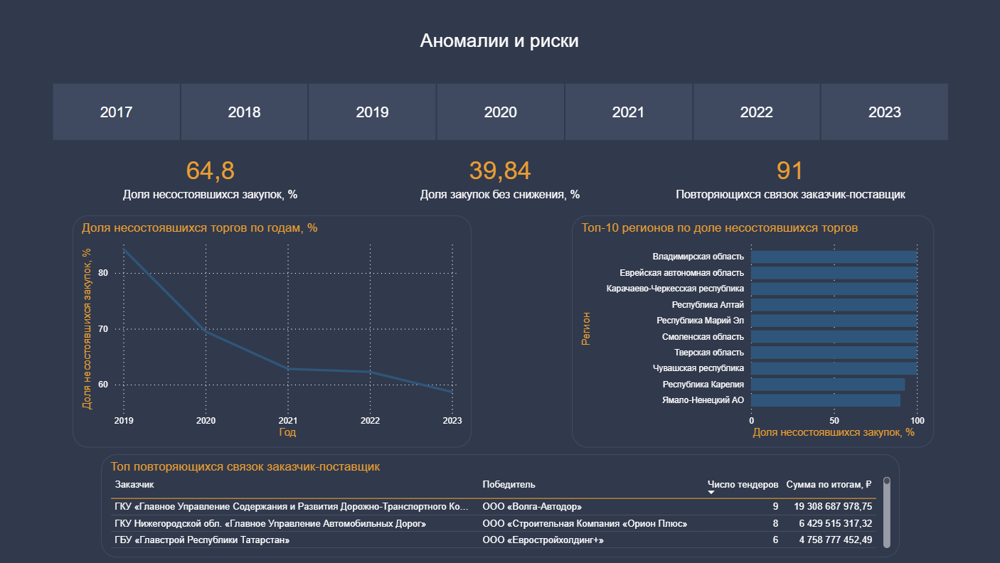

# zakupki-it-analytics

Аналитический дашборд по крупнейшим тендерам российских госзакупок
(контракты от 500 млн ₽ за 2017-2023) на стеке PostgreSQL и Power BI.

Pet-проект для портфолио. Демонстрирует полный цикл работы
с табличными данными: подготовка хранилища, ETL-процесс из CSV в БД, построение
витрин в SQL, моделирование и визуализация в Power BI.

## Дашборд

Четыре страницы: от общего обзора рынка до точечного анализа аномалий.

### Страница 1. Общий обзор

Ключевые KPI: число тендеров, доля состоявшихся, общая сумма НМЦК,
среднее снижение цены на торгах. Динамика по годам и распределение
по типам процедур.



### Страница 2. Заказчики и поставщики

Концентрация рынка: сколько уникальных игроков, какая доля денег
приходится на топ-10 заказчиков и поставщиков. Топ-10 всех контрагентов.



### Страница 3. География

Распределение тендеров по регионам России. Карта с цветовой
кодировкой по средней цене закупки, рядом топ-10 регионов по сумме НМЦК.



### Страница 4. Аномалии и риски

Анализ "проблемных" контрактов: динамика несостоявшихся торгов,
регионы с самой высокой долей срывов, повторяющиеся связки
"заказчик-поставщик".



## Ключевые наблюдения из данных

- В выборке 4519 крупнейших тендеров на сумму 8.96 трлн ₽ за 2017-2023.
- **Состоявшимися признаны только 35% торгов.** Большая часть проводится
  как "признанная несостоявшейся" (по протоколу), но при наличии
  единственного участника контракт всё равно заключается.
- **Доля сорванных торгов снижается:** с 85% в 2019 до 58% в 2023.
  Тренд указывает на постепенное улучшение качества подготовки
  тендерной документации.
- **Концентрация рынка умеренная.** Топ-10 заказчиков формируют 24%
  суммы НМЦК; топ-10 поставщиков получают 31% реально потраченных денег.
- **Найдена 91 повторяющаяся связка** "заказчик-поставщик", где
  поставщик 2+ раза выигрывал у одного и того же заказчика. Это далеко не
  обязательно признак нарушения, но повод для отдельного аудита.

## Стек

- **PostgreSQL 16** в Docker - хранилище.
- **Python** + pandas + sqlalchemy - ETL из CSV в raw-таблицы Postgres.
- **SQL** - построение витрин (схема "звезды": таблица фактов + 4 таблицы измерений).
- **Power BI Desktop** - моделирование и визуализация.
- **DBeaver** - интерактивная работа с БД во время разработки.

## Источник данных

[Russian biggest government procurement contracts](https://www.kaggle.com/datasets/dadalyndell/russian-biggest-government-procurement-contracts)
на Kaggle. Содержит крупнейшие контракты по 44-ФЗ и 223-ФЗ за
2014-2022 (тендеры от 500 млн ₽). Дополнительно используется
исторический курс USD/RUB для пересчёта в долларовый эквивалент.

## Как развернуть локально

### 1. Поднять PostgreSQL в Docker

```bash
docker compose up -d
```

PostgreSQL запустится на порту 5433 (5432 по умолчанию занят локальной
инсталляцией Postgres у многих разработчиков, чтобы избежать конфликта).

Проверить:

```bash
docker compose ps
```

В `STATUS` должно быть `Up X seconds (healthy)`.

### 2. Скачать датасет

Скачать архив с [Kaggle](https://www.kaggle.com/datasets/dadalyndell/russian-biggest-government-procurement-contracts),
распаковать в `sample/`. Структура:

```
sample/
├── tender_data.csv
├── tender_data_description.csv
└── USD_RUB_exchange_rate.csv
```

### 3. Применить схему raw-слоя

В DBeaver (или любом другом SQL-клиенте) подключиться к БД с
параметрами из `.env.example` и выполнить `sql/01_schema.sql`.

### 4. Загрузить данные

```bash
pip install -r requirements.txt
python src/loader.py
```

Скрипт прочитает CSV из `sample/` и запишет в таблицы `raw_tenders` и
`raw_usd_rub`.

### 5. Построить витрины

В DBeaver выполнить `sql/02_marts.sql`. Скрипт создаст звёздную схему:
таблицу фактов `fact_tenders` и четыре таблицы измерений (`dim_customer`,
`dim_winner`, `dim_region`, `dim_date`).

### 6. Открыть дашборд

Открыть `reports/dashboard.pbix` в Power BI Desktop. При первом запуске
Power BI запросит учётные данные для подключения к БД - использовать
те же, что в `.env`.

## Структура проекта

```
zakupki-it-analytics/
├── docker-compose.yml         # PostgreSQL в контейнере
├── .env.example
├── .gitignore
├── requirements.txt
├── README.md
├── sql/
│   ├── 01_schema.sql          # raw-слой
│   └── 02_marts.sql           # звёздная схема витрин
├── src/
│   └── loader.py              # ETL: CSV -> Postgres
├── sample/                    # сырые CSV
└── reports/
    ├── dashboard.pbix         # сам дашборд
    └── dashboard_1..4.png     # скриншоты страниц
```

## Технические детали

### Почему схема "звезды"

Power BI оптимально работает с моделью "одна таблица фактов + таблицы измерений".
В этом случае корректно работает односторонняя кроссфильтрация данных. 
DAX-меры считаются предсказуемо, без неожиданных эффектов.

### Очистка данных в SQL

Сырые данные CSV содержат "грязные" данные: процент аванса хранится строкой
`"30.00%"`, у итоговой цены формат данных иногда не число, у несостоявшихся тендеров
поле победителя пустое. Чистка вынесена в `02_marts.sql`:

- `advance_money "30.00%"` → `advance_pct 30.00` (число).
- `final_price` (текст) → `NUMERIC` через regex-проверку, нечисловой тип → NULL.
- Расчёт `discount_pct` (снижение цены на торгах).
- Пересчёт сумм в USD через JOIN с курсом валют.

### Определение "состоявшейся" закупки

Сначала логика `is_completed` была построена через наличие
`winner_inn`. Это оказалось слишком строгим: у части контрактов с
формальным статусом "Завершена" поле победителя в Kaggle-датасете
пустое (видимо, потери при выгрузке). В итоговой версии
`is_completed = (selection_phase = 'Завершена')`.

### Карта России в Power BI

Заполненная карта (filled map) использует Bing Maps. Распознавание
российских регионов работает неидеально: 4 региона из 89 (Калмыкия,
Ингушетия, Крым) определяются только после нормализации названий 
через английские варианты.
